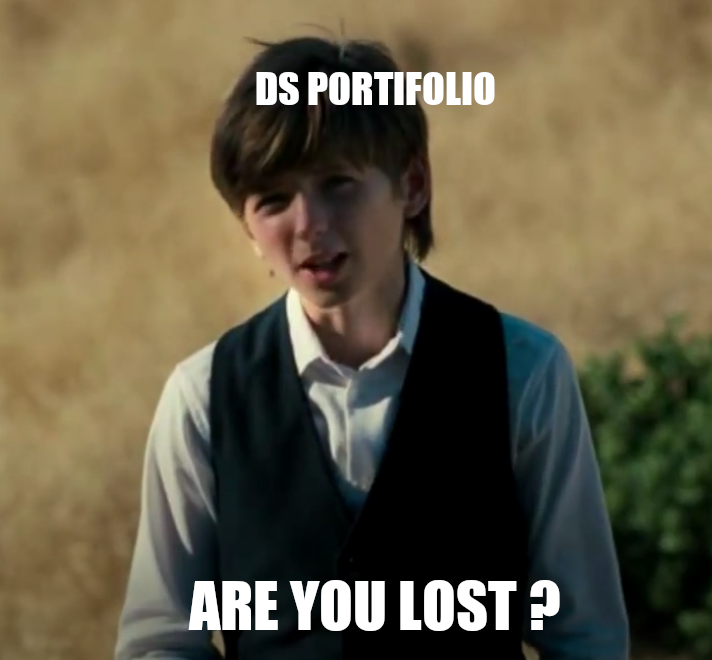
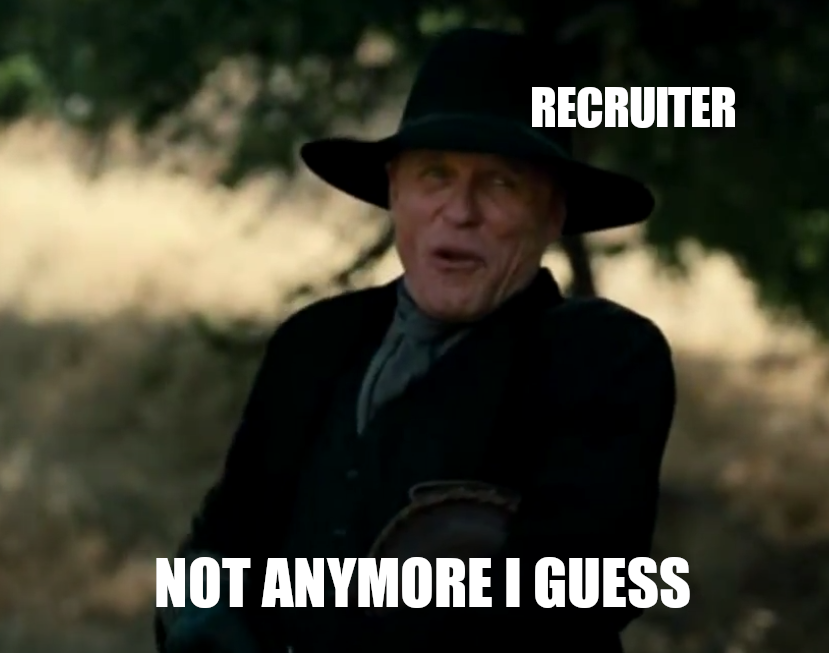
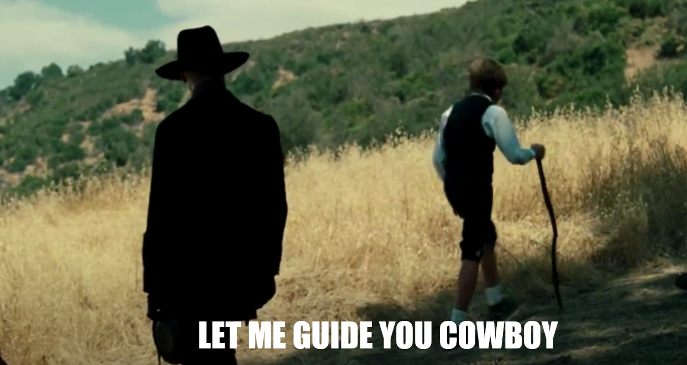

# **Data Science Portifolio Guide** 💡🖥️
  

    
      
    
  

## **Insights Projects** 💡📝

**Business Matter → Business Understanding → Data Collect → Data Cleanup → Data Exploration**

- Simulate a business problem, identify the root cause of this problem, collect data, handle data, raise Hypotheses about business behavior, conduct exploratory data analysis to validate hypotheses, write the insights and your project solution proposal.

1. [Inventory Optimization for a Retail Chain](https://github.com/breno-jesus-fernandes/insights-invetory-optimization)

2. [Customer Segmentation for an E-commerce Company](https://github.com/breno-jesus-fernandes/insights-customer-segmentation)

3. [Fraud Detection for a Financial Services Company](https://github.com/breno-jesus-fernandes/insights-fraud-detection)

## **Data Enginner Projects** 👨🛠

**Data Collect → Data Cleanup → Data Exploration**

- Collect data from external sources (web scraping), save data to a local database, update data with frequency, clean data and explore data.

1.  [Web Scraping and Data Management for a Real Estate Database](https://github.com/breno-jesus-fernandes/de-real-estate)

## **Machine Learning Projects** 🖥️🤖

**Data Collect → Data Cleanup → Data Exploration → Data modeling → Machine Learning Algorithms → Algorithm Evaluation**

- Choose data close to the real, cleaning, exploration, modeling, apply ML Algorithms, evaluate model performance using business metrics

1.  [Predicting Customer Churn for a Telecommunications Company](https://github.com/breno-jesus-fernades/ml-custormer-churn)

2.  [Credit Risk Prediction for a Financial Institution](https://github.com/breno-jesus-fernades/ml-credit-risk)

3.  [Sentiment Analysis for Financial News](https://github.com/breno-jesus-fernandes/ml-sentiment-analysis)

## **End To End Projects** 💯🔁

**Data Collect → Data Cleanup → Data Exploration → Data modeling → Machine Learning Algorithms → Algorithm Evaluation → Production Model**

- Collect, clean and explore a data set, model, apply and evaluate the performance of models, publish the model in production

1.  [Fall Detection System](https://github.com/breno-jesus-fernandes/end-to-end-fall-detection)

2.  [Heart Disease Prediction](https://github.com/breno-jesus-fernandes/end-to-end-heart-disease)

## **Full Data Science Project** 💡📝👨🛠🖥️🤖💯🔁

**Business Matter → Business Understanding → Data Collect → Data Cleanup → Data Exploration → Data modeling → Machine Learning Algorithms → Algorithm Evaluation → Production Model**

1. [Network Intrusion Detection using Machine Learning](https://github.com/breno-jesus-fernandes/full-ds-network-intrusion)

